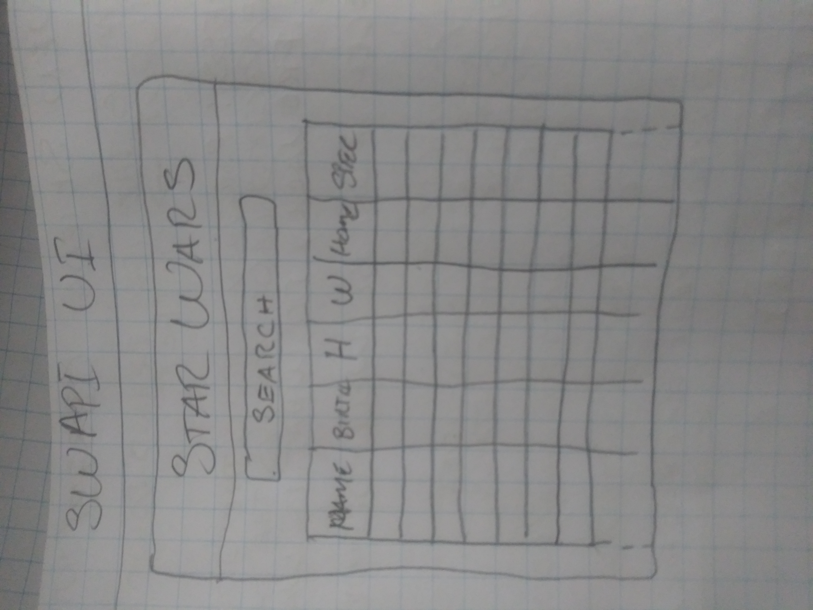

# PLANNING

## Wireframe

## Test Cases

1. When a USER visits the page:

   - a request is sent to the SWAPI for a list of 10 characters.
   - This list is displayed in a table.

2. When a USER enters text into the search input:
   - a request is sent to the SWAPI for matching characters.
   - Any matches are displayed in the table.
     - if no matches are found, a message saying so is displayed

## Steps to Complete

### BASIC SET UP

- `create-react-app` to generate the project
- install `react-bootstrap`
- install `bootstrap`
- install `axios`

### USER INTERFACE

- As a USER I want to see a header for the page
- As a USER I want to see a search input
- As a USER I want to see a table of characters
  - Read about HTML tables
  - Hard code a table in JSX
  - Add the expected table headers
  - Hard code a character into the table
  - break the table down into components:
    - `theader`
    - `tbody`
    - `character_row`? (name? idea?)
  - render these components together to display the table

### API

- Create an API service with Axios
  - Set base URL
  - create getPeople method
- Use `useState` for characters & function to update characters state
- Use `useEffect to make API call when the component mounts
- Display all results in table

- Handle Homeworlds
  - Make api call for Homeworld for each character

### Styling

### TEST CASE PSEUDO CODE

1. When a USER visits the page
   - make `axios` REQUEST to SWAPI for 10 characters
   - FOR EACH character returned, display a new `character_row`
     - IF no characters are returned:
       - Display `No matches found.`
2. When a USER enters text into the search input:
   - make `axios` REQUEST to SWAPI for matching characters
     - FOR EACH character returned:
       - display a new `character_row`
     - IF no characters are returned:
       - Display `No matches found.`

## Things I Did NOT Plan For Or Know About

- Creating an Axios instance to use throughout the app
- Knowing when to use a class component vs a function component
- Where in the app to keep state
- It looks like I'll want to make a call for species, homeworld, to use to get some of a character's details. I only want to do this once and reuse the lists, if at all possible. Where would I want this done? Someplace that only mounts once . . .
- How are tables handled on small devices?

## TODO

I ran out of time considering that the next projects will be more intensive and difficult, so I had to make a choice to not do much styling or refactoring of this project right now.

- Things I would like to implement at some point include:
  - Mobile view. How are tables handled on small devices? react-bootstrap just allows horizontal scrolling, I think.
  - Clear search field option

## Googled

- `how to use Axios in React`:
  - https://www.digitalocean.com/community/tutorials/react-axios-react;
  - https://www.freecodecamp.org/news/how-to-use-axios-with-react/;
- `react use class or function`:
  - https://www.twilio.com/blog/react-choose-functional-components;
- `functional vs object oriented javascript`:
  - https://medium.com/@sho.miyata.1/the-object-oriented-programming-vs-functional-programming-debate-in-a-beginner-friendly-nutshell-24fb6f8625cc;
- `services in React`:
  - https://stackoverflow.com/questions/35855781/having-services-in-react-application;
  - https://medium.com/@dan_abramov/smart-and-dumb-components-7ca2f9a7c7d0;
  - https://medium.com/@learnreact/container-components-c0e67432e005;
