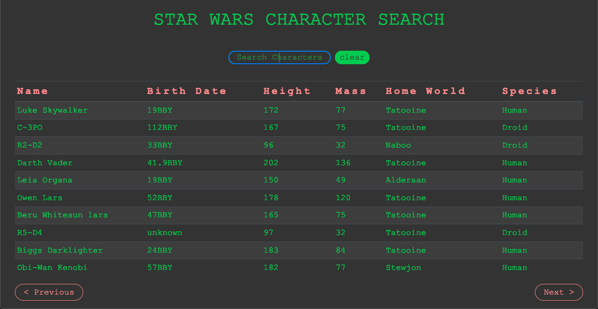

# APPLICATION #6: STAR WARS API APP

## A Study in Consuming Web API's.

[View Live on Heroku](https://skillitzimberg.github.io/swapi/).  

## Summary

This the sixth app on my roadmap part of the Software Development Mastermind program.

The expectations for the project are described in [DELIVERABLES](./DELIVERABLES.md).

The steps I took and other errata encountered while building are in [PLANNING](./PLANNING.md). I tried my best to have the commits track closely with this document.

## Author

Scott Bergler :: Full Stack Developer > [LinkedIn](https://www.linkedin.com/in/scott-bergler/) | [Personal Website](https://oceancode.dev/)
